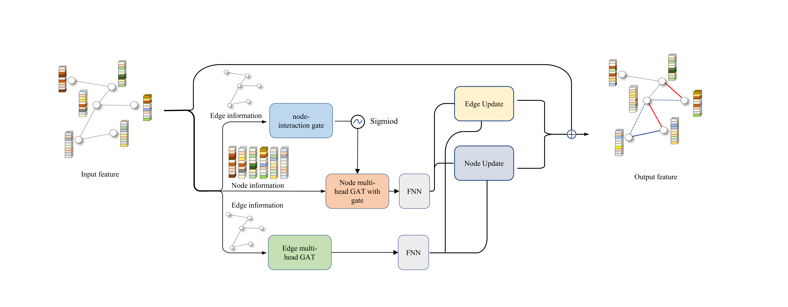

# A highly sensitive model based on graph neural networks for enzyme key catalytic residues prediction  
A new enzyme catalytic sites prediction model use new designed Adaptive Edge-Gated Graph Attention Neural Network(AEGAN) to process both sequence and structure features of proteins at different levels was developed here.  



## Requirements  
  
torch==1.10.0 \
tqdm==4.62.3 \
numpy==1.23.2 \
pytorch-lightning==1.7.2 \
biotite==0.34.1 \
pandas==1.3.4 \
scikit-learn==1.1.1 \
psiblast==2.12.0+
  
## Step-by-step running:  
### Make Dataset
- First, install BlAST using:  
  `conda install -c bioconda blast`
- Download protein database for alignment, using:
  `wget ftp://ftp.uniprot.org/pub/databases/uniprot/uniref/uniref90/uniref90.fasta.gz`  
- compile the protein database as follows:  
  ```
  gzip -d uniref90.fasta.gz
  makeblastdb -in uniref90.fasta -parse_seqids -hash_index -dbtype prot
  ```
- and then, `cd AEGAN/code` ,you can create datasets, using  
  `DataProcess.py -s uni14230 -d your-database-path`  
  there are some parameters you can choose:  
  - `-s`:specifies which dataset to create
    - `uni14230` train dataset
    - `uni3175` test dataset
    - `EF_fold` benchmark dataset
    - `EF_family` benchmark dataset
    - `EF_superfamily` benchmark dataset
    - `HA_superfamily` benchmark dataset
    - `NN` benchmark dataset
    - `PC` benchmark dataset
  - `-t`:(optional) specify where the dataset will be saved
  - `-d`:database path used for BLAST alignment
### train a model
- `cd AEGAN/code`, and use train.py to train a model:
    `python train.py -sm model-saved-path`  
   there are some parameters you can choose:  
   - `--trainset`:The path of the dataset of the training model (default:../database/trainset)  
   - `--batchsize`:batchsize (default:200)
   - `-lr`:learning rate (default:1e-2)
   - `-ly`:layers of AEGAN module (default:24)
   - `--epoch`:Traing epochs (default:1000)
   - `-sm`:Path of saving trained model
   - `--accelerator`: Uesd device to train model (default:gpu)  
        - `cpu`:use cpu to train model
        - `gpu`:use gpu to train model
### test model
- `cd AEGAN/code`, and use validate.py to test model's performance on datasets:  
`python validate.py --model trained-model-path`  
- if you haven't trained a model yet, you can use the model we've trained to test it:  
`python validate.py --model trained_full`
- and you can also get the results of ablation experiment using the trained model:
`python validate.py --model EP --lack PSSM`  
there are also some parameters you can choose:  
    - `--model`:specifies the path of the model to test. it can be a model file or folder contains model files.
        - `trained_full`:trained full features model
        - `EP`:trained model which features exclude PSSM
        - `EAT`:trained model which features exclude Atchley
        - `EAM`:trained model which features exclude AtomModel
    - `--testset`:Test dataset (default:uni3175)  
        - `uni3175`
        - `EF_fold`
        - `EF_family`
        - `EF_superfamily`
        - `HA_superfamily`
        - `NN`
        - `PC`
    - `--lack`:specify which feature is missing
        - `PSSM`
        - `Atchley`
        - `AtomModel`
    - `--accelerator`: Uesd device to train model (default:gpu)  
         - `cpu`:use cpu to train model
         - `gpu`:use gpu to train model
    - `--batchsize`:batchsize (default:100)
